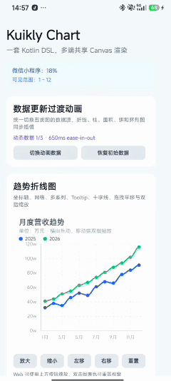

# KuiklyChartView

基于 [KuiklyUI](https://github.com/Tencent-TDS/KuiklyUI) 与 Kotlin Multiplatform
实现的跨端 Canvas 图表组件。组件提供折线图、柱状图、面积图、饼图、环形图和
混合图，并内置坐标轴、网格、图例、Tooltip、视窗手势与数据过渡动画；核心模型、
DSL、绘制和交互均位于 `commonMain`，同一套 Kotlin API 可用于 Android、iOS、
Web（Kotlin/JS）和 OpenHarmony。

## 演示 Demo

<p align="center">
  <a href="docs/assets/ChartViewDemo.mp4">
    
  </a>
</p>

> 点击演示图可查看完整演示视频。

演示页面名为 `chart_demo`，完整源码见
[`ChartDemoPage.kt`](shared/src/commonMain/kotlin/com/guet/liang/kuiklychartview/ChartDemoPage.kt)。
Demo 覆盖五类图表、动态数据动画、选中回调、横向平移、双指缩放、程序化视窗控制
以及运行时柱状图配色。

## 能力矩阵

| 能力 | 本仓库实现 |
| --- | --- |
| 折线图 | 多系列、直线/平滑曲线、数据点、断点和数值标签 |
| 柱状图 | 分组柱、正负值、零基线、圆角、逐系列或逐柱颜色 |
| 面积图 | 直线/平滑边界、透明度和跨端线性渐变填充 |
| 饼图与环形图 | 扇区颜色、间距、选中偏移、内半径和多种标签模式 |
| 混合图 | 在同一坐标系中组合折线、柱和面积系列 |
| 坐标系统 | X/Y 轴、自动范围、nice-number 刻度、格式化与横纵网格 |
| 图例与提示 | 自动换行图例、Tooltip、十字线和结构化选中结果 |
| 数据动画 | 折线、柱、面积、饼和环形图运行时平滑插值 |
| 手势交互 | 点击选中、横向平移、双指缩放、双击重置且不阻塞页面纵向滚动 |
| 命令式控制 | 视窗设置、缩放、平移、选择、清除和动态更新 |
| 多平台支持 | Android、iOS、Web 与 OpenHarmony 共用组件和 Demo 代码 |

## 功能概览

- `Chart`、`LineChart`、`BarChart`、`AreaChart`、`PieChart` 类型安全入口
- 多系列数据、分类标签、折线断点和自动颜色调色板
- 标题、副标题、图例、坐标轴、网格、空数据状态和主题 token
- Tooltip、十字线、点/柱/扇区命中和类型化事件回调
- 小数索引视窗、横向连续平移、双指焦点缩放和双击重置
- `update {}` 数据过渡动画与连续更新衔接
- `ViewRef<ChartView>` 命令式运行时控制
- 不依赖平台原生图表 View 的纯 Kuikly Canvas 实现

## 工程结构

```text
kuikly-chart/
└── src/
    ├── commonMain/kotlin/.../
    │   ├── ChartView.kt                 组件入口、状态、事件与手势
    │   ├── api/                         数据模型、DSL 与样式配置
    │   └── internal/                    几何、刻度、命中、动画与 Canvas 渲染
    └── commonTest/kotlin/.../            DSL、视窗、刻度、命中与动画测试

shared/
└── src/commonMain/kotlin/.../
    └── ChartDemoPage.kt                  完整演示页面

androidApp/                                Android 宿主
iosApp/                                    iOS 宿主
ohosApp/                                   OpenHarmony 宿主
docs/                                      API、架构文档与演示资源
```

## 平台支持

| 平台 | 仓库支持 | 验证入口 |
| --- | --- | --- |
| Android | `androidApp` 宿主与 Android target | `./gradlew :androidApp:assembleDebug` |
| iOS | `iosApp` 宿主与 x64/arm64/Simulator targets | `./gradlew :kuikly-chart:compileKotlinIosSimulatorArm64` |
| Web | Kotlin/JS browser target | `./gradlew :kuikly-chart:compileKotlinJs` |
| OpenHarmony | `ohosApp` 宿主与 ohos-arm64 target | `./gradlew -c settings.ohos.gradle.kts :shared:compileKotlinOhosArm64` |

当前工程使用 Kuikly `2.7.0`。Web Canvas 的部分文本属性在该版本未实现，组件通过
`measureText` 与手工坐标完成文本布局；Web 触摸事件不提供完整双指信息，因此 Demo
使用 `zoomIn()` / `zoomOut()` 按钮作为缩放降级方案。

## 环境与构建

建议使用 JDK 17 或更高版本及 Android Studio。iOS 构建需要 macOS 与 Xcode；
OpenHarmony 构建和运行需要 DevEco Studio 及对应 SDK。

```bash
# 图表模块单元测试
./gradlew :kuikly-chart:testDebugUnitTest

# Android Debug APK
./gradlew :androidApp:assembleDebug

# Web / Kotlin JS
./gradlew :kuikly-chart:compileKotlinJs

# iOS Simulator
./gradlew :kuikly-chart:compileKotlinIosSimulatorArm64

# OpenHarmony / ohos-arm64
./gradlew -c settings.ohos.gradle.kts :shared:compileKotlinOhosArm64
```

Android Studio 直接打开仓库并运行 `androidApp` 即可进入 `chart_demo`。iOS 使用
Xcode 打开 `iosApp/iosApp.xcworkspace`。OpenHarmony 使用 DevEco Studio 打开
`ohosApp`。

## 接入方式

仓库内 KMP 模块可直接依赖 `kuikly-chart`：

```kotlin
kotlin {
    sourceSets {
        val commonMain by getting {
            dependencies {
                implementation(project(":kuikly-chart"))
            }
        }
    }
}
```

发布到本机 Maven：

```bash
./gradlew :kuikly-chart:publishToMavenLocal
```

随后可按当前工程坐标接入：

```kotlin
dependencies {
    implementation("com.guet.liang.kuiklychartview:kuikly-chart:1.0.0")
}
```

组件公共层依赖 Kuikly Core，具体版本以
[`KotlinBuildVar.kt`](buildSrc/src/main/java/KotlinBuildVar.kt) 为准。

## API 速览

| API | 用途 |
| --- | --- |
| `Chart { ... }` | 添加可混合折线、面积和柱系列的图表 |
| `LineChart { ... }` | 添加默认折线系列的图表 |
| `BarChart { ... }` | 添加默认柱系列的图表 |
| `AreaChart { ... }` | 添加默认面积系列的图表 |
| `PieChart { ... }` | 添加饼图或环形图 |
| `chart { ... }` | 首次配置数据、样式、动画和交互 |
| `update(animated) { ... }` | 运行时更新图表数据与配置 |
| `ChartEvent` | 监听选中变化、数据点选中和视窗变化 |
| `ChartView` | 读取状态并通过命令式方法控制图表 |
| `ChartTheme` | 设置颜色、字号、内边距和提示框主题 |

完整属性与默认值见 [API 文档](docs/API.md)，渲染流程和跨端实现见
[架构文档](docs/ARCHITECTURE.md)。

## 基本用法

```kotlin
import com.guet.liang.kuiklychart.LineChart
import com.tencent.kuikly.core.base.Color

LineChart {
    attr {
        height(280f)
    }
    chart {
        title = "周活跃用户"
        subtitle = "单位：千人"
        labels("周一", "周二", "周三", "周四", "周五")
        series("DAU", 12f, 18f, 16f, 25f, 28f) {
            color(Color(0xFF2563EBL))
            smooth()
            points(radius = 3f)
        }
        axes {
            y {
                includeZero = true
                formatter = { value -> "${value.toInt()}k" }
            }
        }
        grid {
            horizontal = true
            dashed(4f, 4f)
        }
        interaction {
            selectionEnabled = true
            panEnabled = true
            zoomEnabled = true
        }
    }
    event {
        pointSelected { selection ->
            println("${selection.label}: ${selection.value}")
        }
    }
}
```

## 图表 DSL

便捷组件中的 `series(...)` 会自动使用对应系列类型：

```kotlin
LineChart { chart { series("趋势", 1f, 3f, 2f) } }
BarChart  { chart { series("销量", 8f, 12f, 10f) } }
AreaChart { chart { series("流量", 3f, 6f, 5f) } }
PieChart  { chart { labels("A", "B"); series("占比", 70f, 30f) } }
```

### 混合图

```kotlin
Chart {
    chart {
        labels("Q1", "Q2", "Q3", "Q4")
        bars("订单", 42f, 58f, 63f, 79f) {
            valueLabels()
        }
        area("目标", 48f, 55f, 68f, 82f) {
            smooth()
        }
        line("转化率", 31f, 38f, 45f, 52f) {
            smooth()
        }
    }
}
```

### 柱状图

```kotlin
BarChart {
    chart {
        labels("自然", "广告", "推荐")
        series("新增", 82f, 64f, 91f) {
            barColors(
                Color(0xFF2563EBL),
                Color(0xFF7C3AEDL),
                Color(0xFF10B981L),
            )
            valueLabels()
        }
    }
}
```

### 饼图与环形图

```kotlin
PieChart {
    chart {
        pie(
            "订单",
            PieEntry("App", 42f, Color(0xFF2563EBL)),
            PieEntry("Web", 31f, Color(0xFF10B981L)),
            PieEntry("门店", 27f, Color(0xFFF59E0BL)),
        )
        pie {
            innerRadiusRatio = 0.5f
            labelMode = PieLabelMode.PERCENT
        }
    }
}
```

## 动态数据与过渡动画

`chart {}` 用于首次配置。组件挂载后可通过 `ViewRef` 调用 `update {}`，默认从当前
显示值平滑插值到目标值；连续更新会从屏幕上的当前值继续，不会跳回旧数据。

```kotlin
private var chartRef: ViewRef<ChartView>? = null

LineChart {
    ref { chartRef = it }
    chart {
        labels("Q1", "Q2", "Q3", "Q4")
        line("订单", 42f, 58f, 63f, 79f)
        animation {
            enabled = true
            durationMillis = 650
            easing = ChartAnimationEasing.EASE_IN_OUT
        }
    }
}

chartRef?.view?.update {
    series[0].values(55f, 49f, 76f, 92f)
}

chartRef?.view?.update(animated = false) {
    clearSeries()
    line("订单", 31f, 62f, 70f, 88f)
}
```

## 手势与视窗

- 点击数据点、柱或饼图扇区可展示 Tooltip，并触发结构化选中事件。
- `panEnabled = true` 时，单指横向拖动会连续更新小数索引视窗。
- 图表位于纵向 `Scroller` 中时，图表仅处理横向拖动，不阻塞页面上下滑动。
- `zoomEnabled = true` 时，Android、iOS 和 OpenHarmony 支持双指焦点缩放。
- 双击默认恢复完整数据范围，也可通过配置关闭。
- Web 使用命令式缩放按钮降级，其他视窗 API 保持一致。

```kotlin
private var chartRef: ViewRef<ChartView>? = null

LineChart {
    ref { chartRef = it }
}

chartRef?.view?.setViewport(2f, 8f)
chartRef?.view?.zoomIn()
chartRef?.view?.zoomOut()
chartRef?.view?.panBy(2f)
chartRef?.view?.resetViewport()
```

## 事件 API

```kotlin
event {
    selectionChanged { selectionOrNull ->
        println(selectionOrNull)
    }
    pointSelected { selection ->
        println("${selection.seriesName} · ${selection.label}: ${selection.value}")
    }
    viewportChanged { viewport ->
        println("${viewport.startIndex} - ${viewport.endIndex}")
    }
}
```

| 事件 | 说明 |
| --- | --- |
| `selectionChanged` | 选中数据或清除选中时触发，参数可为空 |
| `pointSelected` | 成功选中点、柱或扇区后触发 |
| `viewportChanged` | 手势或命令式 API 改变可见范围后触发 |

`ChartSelection` 包含 `seriesIndex`、`dataIndex`、`seriesName`、`label`、
`value` 和 `type`。`ChartViewport` 包含 `startIndex`、`endIndex` 与
`visiblePointCount`。

## 命令式 API

| 方法/属性 | 说明 |
| --- | --- |
| `currentSelection` | 当前选中数据，无选中时为 `null` |
| `currentViewport` | 当前可见分类索引范围 |
| `update(animated = true) {}` | 动态更新数据和配置 |
| `setViewport(startIndex, endIndex)` | 设置支持小数的可见范围 |
| `resetViewport()` | 恢复完整范围并清除选中 |
| `zoomIn(factor = 1.5f)` | 以视窗中心放大 |
| `zoomOut(factor = 1.5f)` | 以视窗中心缩小 |
| `panBy(categoryCount)` | 按分类数量平移 |
| `select(seriesIndex, dataIndex)` | 程序化选择数据 |
| `clearSelection()` | 清除 Tooltip、十字线和扇区选择 |

## 主题与样式

`ChartTheme` 提供背景、文字、坐标轴、网格、十字线、Tooltip、选中色、字号和
内容内边距等 token。各系列还可独立设置颜色、线宽、曲线、数据点、填充透明度和
数值标签。

```kotlin
chart {
    theme {
        backgroundColor = Color.WHITE
        textColor = Color(0xFF0F172AL)
        mutedTextColor = Color(0xFF64748BL)
        gridColor = Color(0xFFE2E8F0L)
        contentPadding(16f)
    }
}
```

坐标轴、图例、Tooltip、柱状图和饼图的完整样式字段与默认值见
[`docs/API.md`](docs/API.md)。

## Demo 覆盖场景

[`ChartDemoPage.kt`](shared/src/commonMain/kotlin/com/guet/liang/kuiklychartview/ChartDemoPage.kt)
展示：

- 五类图表统一切换数据源与过渡动画
- 双系列趋势折线、Tooltip、十字线、平移和缩放
- 分组柱、正负值、逐柱颜色与运行时配色切换
- 平滑渐变面积图和折线/柱/面积混合图
- 饼图、环形图、百分比标签、图例和扇区选中
- `selectionChanged`、`pointSelected` 与 `viewportChanged` 回调
- Android、iOS、Web 与 OpenHarmony 共用页面实现

## 测试与验证

`commonTest` 当前包含 44 个测试，覆盖：

- DSL 数据构建、配置更新与只读数据视图
- 视窗初始化、归一化、平移和焦点缩放
- 自动范围、nice-number 刻度与颜色解析
- 折线点、柱和饼图扇区命中
- 数据插值、系列增删、断点、连续更新与 easing

```bash
./gradlew :kuikly-chart:testDebugUnitTest
./gradlew :kuikly-chart:compileTestKotlinJs
./gradlew :kuikly-chart:compileKotlinJs
./gradlew :kuikly-chart:compileKotlinIosSimulatorArm64
./gradlew :androidApp:assembleDebug
```

## 当前边界

- 图表模块尚未发布到公共 Maven 仓库，外部项目需源码接入或自行发布制品。
- Web 端当前使用按钮完成缩放，不支持与移动端相同的原生双指缩放。
- 自动化测试主要覆盖纯 Kotlin 数据、几何和动画逻辑；视觉与手势仍需结合各平台
  Demo 验证。
- 图例会根据可用宽度自动换行，但极长标签仍建议由业务侧格式化或缩短。

## 相关资料

- [Kuikly ComposeView 开发文档](https://kuikly.tds.qq.com/DevGuide/compose-view.html)
- [Kuikly Canvas API](https://kuikly.tds.qq.com/API/components/canvas.html)
- [Kuikly 基础事件](https://kuikly.tds.qq.com/API/components/basic-attr-event.html)
- [Kuikly 多模块](https://kuikly.tds.qq.com/DevGuide/multi_module.html)
- [KuiklyUI 主仓库](https://github.com/Tencent-TDS/KuiklyUI)
- [KuiklyChatUI 工程范例](https://github.com/Kuikly-contrib/KuiklyChatUI)
